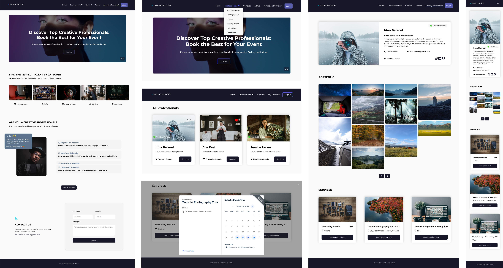
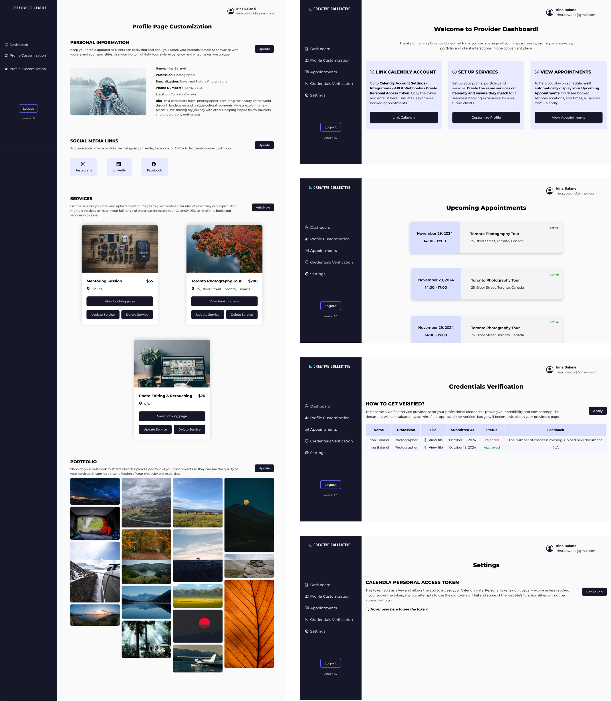
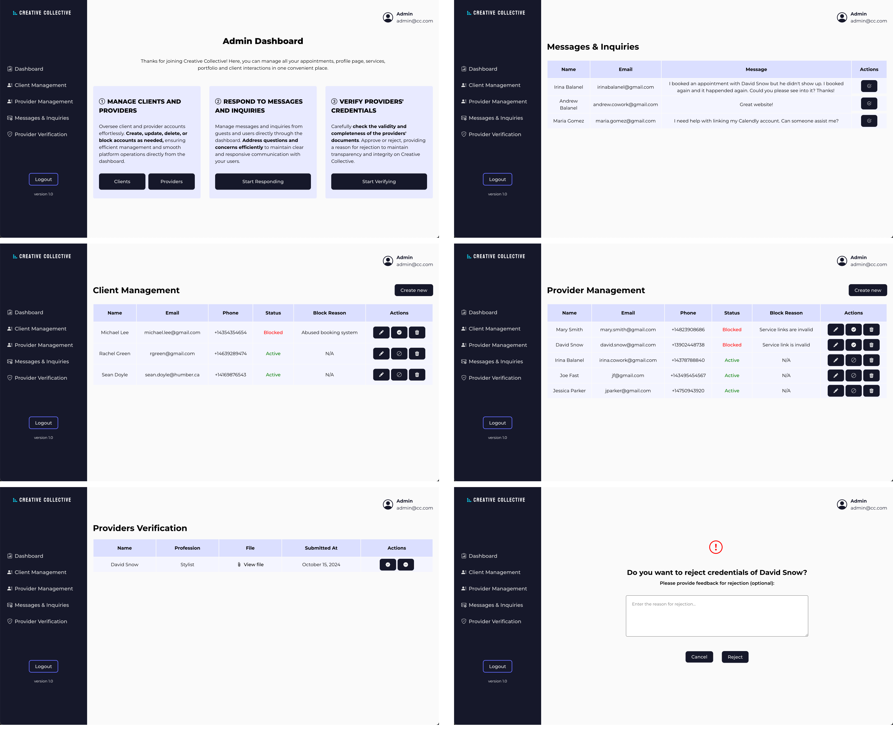

# Creative Collective: Appointment Booking App for Creative Professionals

## Overview

I built Creative Collective to address a real-world problem faced by creative professionals like photographers, makeup artists, stylists, and set decorators. While platforms like Behance cater to digital creators and niche apps serve specific services like barbers or wedding planners, there wasn’t a unified platform for broader creative services. This app bridges that gap, providing a space where professionals can showcase their work and manage bookings, while clients can conveniently find and book their services.

The project consists of 3 products: a client-facing site, a provider dashboard, and an admin panel. [Click here to go to the website](https://creative-collective.irinabalanel.com/).

## Development Process

Initially, I scoped 33 user stories, estimating 400 hours to complete them. Realizing this wasn’t feasible, I prioritized the 17 must-have stories and completed 21 user stories within approximately 200 hours.

I followed an agile approach, iterating through each phase of development:
1.	Market analysis and defining business requirements through user stories
2.	Designing and prototyping UI/UX in Figma
3.  Conducting user testing to gather feedback and adjust the interface
4.  Implementing and testing features iteratively
5.  Deploying the app

The entire project was tracked using a project management system I built in Notion, ensuring timely progress on each deliverable.

## Usability Improvements

Based on feedback and usability testing, I made the following improvements:

### Landing Page

- Added profile images on provider details pages to build trust.
- Included a tooltip explaining the “Verified” badge for clarity.
- Added social media links and phone numbers to improve provider credibility and facilitate communication.

### Provider Dashboard

- Replaced vague terms like “Creative Type” with intuitive ones like “Profession” and “Specialization.”
- Improved layout for better visibility of appointment dates and times.

## Tech Stack: MERN

- Frontend: Built with React’s component-based architecture for scalability and maintainability
- Backend: API development with Node.js and Express
- Database: Modelled using Mongoose (ODM) for MongoDB hosted on Atlas
- Features: User authentication, role-based access control, Calendly API integration for booking functionality, Soft deletes for data safety and flexibility

## Features

### Client-facing website

- Search functionality by professional category for quick access to providers
- Provider Details Page: Personal and contact information, portfolio and services
- Booking Service Functionality: Integrated with Calendly API for seamless scheduling
- Favorites: Management of preferred providers
- Contact form

### Provider Dashboard

- Customizable Provider Page: CRUD functionality for personal information, social media links, portfolios, and services.
- Upcoming Appointments: Built with Calendly API for easy schedule access.
- Credentials Verification: Enhanced trust and credibility with verified accounts.
- Account Settings: Options to link Calendly accounts to Creative Collective to stay on track with bookings.

### Admin Panel

- CRUD for Users: Client and Provider Management, with options for soft deletes and account blocking.
- Messages Management: Inquiries Consolidation from the contact form for quick processing.
- Provider Verification: Functionality to review and verify provider credentials for badge assignment.

## Lesson Learned

This project taught me the importance of adaptability in software development. Although I couldn’t implement features like reviews, Google Maps integration, and advanced search within the timeframe, I learned to prioritize effectively and deliver a fully functional product. The project idea gives space for creativity and future enhancement.

## More projects
Explore more of my work on my portfolio: [irinabalanel.com](https://irinabalanel.com)

## Interface

### Client-facing website interface

### Provider Dashboard

### Admin Panel

